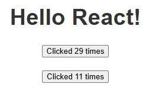
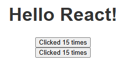
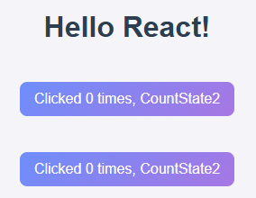

# 202130113 노형진
## 2025-04-10 6주차
### 틱택토 만들기
#### props를 통해 데이터 전달하기

- 사각형 클릭 시 값을 변경해야 하는 상황   
- 기존 방법으론 `<button>` 9개 다 복붙해야 해서 비효율적  
- React 컴포넌트 구조 활용해 중복 제거 가능

---

1. `Square` 컴포넌트 따로 만듦  
```jsx
function Square() {
  return <button className="square">1</button>;
}
```

2. `Board` 컴포넌트는 JSX로 `<Square />` 9개 렌더링  
   대문자로 시작해야 사용자 정의 컴포넌트로 인식됨

3. 이렇게 하면 숫자가 다 "1"로 나옴  
   → 각 칸에 다른 값 넣으려면 `props` 사용해야 함

---

4. `Square`에서 `props.value` 받아서 표시하도록 수정  
```jsx
function Square({ value }) {
  return <button className="square">{value}</button>;
}
```

5. `value` 변수로 인식되게 하려면 중괄호 `{}` 필요  
   → 그냥 `value` 쓰면 문자열 `"value"`로 나옴

   현재는 `Board`에서 value를 안 넘겨줘서 빈 보드로 보임

---

7. `Board`에서 `Square`에 각각 `value` prop 넘겨줌  
```jsx
<Square value="1" />
<Square value="2" />
...
```

8. 이제 다시 숫자 있는 보드가 보임  
→ props를 통해 값 전달, 컴포넌트 재사용 가능해짐

#### 사용자와 상호작용하는 컴포넌트 만들기

- Square를 클릭했을 때 동작 추가하려 함  
- 먼저 `handleClick` 함수 만들어 `onClick`으로 연결  
```jsx
function handleClick() {
  console.log('clicked!');
}
```

- 클릭 시 콘솔에 "clicked!" 뜰 거고, 여러 번 눌러도 콘솔 줄 안 늘고, 숫자만 증가함  
- 로컬 환경이면 크롬 기준 `Shift + Ctrl + J`로 콘솔 열어야 함

---

- 이제 클릭 상태 기억해서 `"X"` 표시하게 만들 계획  
- React의 `useState` 훅 사용함  
```js
import { useState } from 'react';
```

- Square 내부에서 state 선언  
```jsx
const [value, setValue] = useState(null);
```

- 더 이상 `props` 안 씀 → `Board`에서 `Square`에 넘기던 `value` prop 삭제

---

- 클릭하면 `value`를 `'X'`로 바꿈  
```jsx
function handleClick() {
  setValue('X');
}
```

- 버튼 안에는 `{value}` 그대로 사용. 클릭 시 "X" 표시됨

---
## 2025-04-03 5주차
#### 이벤트에 응답하기
component 내부에 event handler 함수를 선언하면 event에 응답할 수 있음   
onClick={handleClick}의 끝에 소괄호가 없음   
함수를 호출하지 말고 전달만 하면 됨   
React는 사용자가 버튼을 클릭할 때 이벤트 핸들러를 호출함
```js
export default function MyButton() {
  function handleClick() {
    alert("You clicked me!");
  }

  return <button onClick={handleClick}>Click me!</button>;
}
```
다 적용한 MyButton.js의 모습

#### 화면 업데이트하기
컴포넌트가 특정 정보를 “기억”하여 표시하기를 원하는 경우가 종종 있음   
예를 들어 버튼이 클릭된 횟수를 세고 싶을 수 있음   
이렇게 하려면 컴포넌트에 state를 추가하면 됨   


먼저, React에서 useState를 가져오고,   
```js
import { useState } from 'react';
```
이제 컴포넌트 내부에 state 변수를 선언할 수 있음
```js
function MyButton() {
  const [count, setCount] = useState(0);
  // ...
```
useState로부터 현재 state (count)와 이를 업데이트할 수 있는 함수(setCount)를 얻을 수 있음   
이들을 어떤 이름으로도 지정할 수 있지만 [something, setSomething]으로 작성하는 것이 일반적임   

버튼이 처음 표시될 때는 useState()에 0을 전달했기 때문에 count가 0이 됨   
state를 변경하고 싶다면 setCount()를 실행하고 새 값을 전달
이 버튼을 클릭하면 카운터가 증가함   
```js
function MyButton() {
  const [count, setCount] = useState(0);

  function handleClick() {
    setCount(count + 1);
  }

  return (
    <button onClick={handleClick}>
      Clicked {count} times
    </button>
  );
}
```
React가 컴포넌트 함수를 다시 호출함  
이번에는 count가 1이 되고, 그 다음에는 2가 될 것   

같은 컴포넌트를 여러 번 렌더링하면 각각의 컴포넌트는 고유한 state를 얻게 됨   
각 버튼을 개별적으로 클릭해 보기   

```js
import { useState } from "react";

export default function MyButton() {
  const [count, setCount] = useState(0);

  function handleClick() {
    setCount(count + 1);
  }

  return <button onClick={handleClick}>Clicked {count} times</button>;
}
```
다 적용한 MyButton.js의 모습, 아래는 적용된 이미지   
   
버튼이 각각 클릭된 횟수를 저장함

각 버튼이 고유한 count state를 “기억”하고 다른 버튼에 영향을 주지 않는다는 점 기억하기

#### Hook 사용하기
use로 시작하는 함수가 Hook임   
useState는 React에서 기본 제공하는 내장 Hook임   
다른 내장 Hook은 공식 API 참고서에서 찾을 수 있음   
기존 Hook을 조합해서 직접 Hook 만들 수도 있음   
Hook은 일반 함수보다 더 제한적임   
컴포넌트나 다른 Hook의 최상단에서만 호출 가능함   
조건문이나 반복문 안에서 useState 쓰면 안 됨   
그렇게 하고 싶으면 새 컴포넌트로 분리해서 사용해야 함   

#### 컴포넌트 간에 데이터 공유하기

이전에는 `MyButton`마다 독립적인 `count` state가 있었음   
그래서 버튼을 클릭해도 **클릭한 버튼의 count만 증가**했음   

하지만 **두 개의 버튼이 같은 count를 공유해야 할 때**가 있음    
그러려면 **state를 공통 부모 컴포넌트로 올려야 함**    

이 예제에서는 `MyApp`이 부모 역할을 함 

**1. 처음 상태 (`MyApp`이 `count` 관리 X)**  
```jsx
export default function MyApp() {
  return (
    <div>
      <h1>Counters that update separately</h1>
      <MyButton />
      <MyButton />
    </div>
  );
}

function MyButton() {
  const [count, setCount] = useState(0);

  function handleClick() {
    setCount(count + 1);
  }

  return <button onClick={handleClick}>Clicked {count} times</button>;
}
```
이 상태에서는 **각 버튼이 독립적인 `count`를 가짐**  

**2. `count`를 `MyApp`에서 관리하도록 변경**  
```jsx
export default function MyApp() {
  const [count, setCount] = useState(0);

  function handleClick() {
    setCount(count + 1);
  }

  return (
    <div>
      <h1>Counters that update together</h1>
      <MyButton count={count} onClick={handleClick} />
      <MyButton count={count} onClick={handleClick} />
    </div>
  );
}
```
`count`와 `handleClick`을 **props로 전달**해서 **모든 버튼이 같은 `count`를 공유하도록 변경**  

**3. `MyButton`에서 props 사용하도록 수정**
```jsx
function MyButton({ count, onClick }) {
  return <button onClick={onClick}>Clicked {count} times</button>;
}
```
`count`와 `onClick`을 **부모 컴포넌트(`MyApp`)에서 전달받아 사용함**  

**결과**  
   
숫자가 같이 올라간다

버튼을 클릭하면 **부모(`MyApp`)의 `count`가 증가**  
모든 버튼이 **같은 `count`를 공유**  
이걸 **"state 끌어올리기 (lifting state up)"** 라고 함
```js
import MyButton from "./MyButton";
import { Button1, Button3 } from "./ButtonLib";
import AboutPage from "./AboutPage";
import Profile from "./Profile";
import "./App.css";
import ShoppingList from "./ShoppingList";
import { useState } from "react";

function CountState2({ count, onClick }) {
  return (
    <div>
      <button onClick={onClick}>Clicked {count} times, CountState2</button>
    </div>
  );
}

export default function App() {
  const [count, setCount] = useState(0);

  function handleClick() {
    setCount(count + 1);
  }
  return (
    <div>
      <h1>Hello React!</h1>
      <CountState2 count={count} onClick={handleClick} />
      <CountState2 count={count} onClick={handleClick} />
      <MyButton count={count} onClick={handleClick} />
      <MyButton count={count} onClick={handleClick} />
      &nbsp;&nbsp;
      <Button1 />
      &nbsp;
      <Button3 />
      <br />
      <AboutPage />
      <Profile />
      <ShoppingList />
    </div>
  );
}
```
   
이건 App.js 내부에 CountState2로 정의한 것

### **Function Component vs Class Component 비교**  

| **비교 항목**      | **Function Component** | **Class Component** |
|-------------------|----------------------|---------------------|
| **작성 방식**      | `function` 키워드 사용 | `class` 키워드 사용 |
| **State 사용**    | `useState` Hook 사용  | `this.state` 사용 |
| **이벤트 핸들링** | `onClick={handleClick}` | `this.handleClick = this.handleClick.bind(this);` 필요 |
| **라이프사이클 메서드** | `useEffect` Hook 사용 | `componentDidMount`, `componentDidUpdate`, `componentWillUnmount` |
| **코드 길이**      | 짧고 간결함 | 상대적으로 길고 복잡함 |
| **성능**          | React 16.8 이후 더 최적화됨 | 상대적으로 무거움 |
| **사용 권장 여부** | 추천 (최신 React 스타일) | 잘 사용하지 않음 (옛날 방식) |

### 틱택토 만들기

여기서 배울 내용
- 환경 설정 : 개발환경 설정
- 개요 : Components, props, state에 대해 학습
- 게임 완료하기 : React에서 가장 많이 사용되는 기술 학습
- 시간여행 추가하기 : React만의 강점에 대해 학습

만들 것 :
- 상호작용할 수 있는 틱택토 게임
- 두 사람이 번갈아 빈칸에 말을 놓아서 3개의 말을 한 줄로 완성하면 승리
- 화면 오른쪽에 번호가 있는 목록을 생성
- 목록에 게임에서 발생한 착수를 모두 기록하며 게임이 진행될 때 동시에 업데이트

먼저 정사각형부터 만들기
```js
export default function Square() {
  return <button className="square">1</button>;
}
```


## 2025-03-27 4주차
### 빠르게 시작하기
#### Component 생성 및 중첩 방법
component는 고유한 로직과 모양을 가진 UI의 일부   
component는 버튼처럼 작을 수도 있고, 전체 페이지처럼 클 수도 있음   
component는 마크업을 반환(return)하는 JavaScript 함수   
Nesting은 css 선택자의 중첩 구조를 생각하기   

export default 키워드는 파일 내의 component 중 기본 component를 지정   

export default와 export의 차이   
Named Exports   
하나의 파일 안에 여러 개의 component가 있을 때 사용   

Default Exports   
하나의 파일 안에서 하나의 component만 내보내는 경우 사용    
component를 사용하는 쪽에서는 어떤 이름을 사용해도 상관 없음    
```html
App.js
import MyButton from "./MyButton";

export default function App() {
  return (
    <div>
    <h1>Hello React!</h1>
    <MyButton/>
    </div>
  );
}
```
이것과,
```html
MyButton.js
export default function MyButton() {
    return (
        <button>Click me!</button>
    );
}
```
이 파일이 있을 때, import 이름 from "MyButton.js의 상대 위치 경로"로 App.js에 넣어줄 수 있음   

```html
ButtonLib.js
function Button1() {
    return (
        <button>Button1</button>
    )
}
function Button2() {
    return (
        <button>Button2</button>
    )
}
function Button3() {
    return (
        <button>Button3</button>
    )
}
export { Button1, Button2, Button3 };
```
여러 개를 export 할 때 예시   

component 이름은 항상 대문자로 시작   

#### 마크업과 스타일을 추가하는 방법
JSX로 마크업 작성하기   
React 프로젝트에서는 편의성을 위해 JSX를 사용   
JSX는 HTML보다 더욱 엄격한 문법을 적용   
JSX에선 <br/>처럼 싱글 태그라도 닫기   
React에서는 component 여러 개를 JSX 태그로 반환 가능   
대신 <div>...</div>처럼 wrapping 해주기   

```html
AboutPage.js
export default function AboutPage() {
    return (
        <div>
            <h1>About</h1>
            <p>Hello there.<br/>How do you do?</p>
        </div>
    );
}

<div>...</div>로 묶어주기
```

스타일 추가하기   

React에서는 className으로 CSS 클래스를 지정   
className은 HTML의 class 속성과 동일한 방식으로 동작   
CSS 규칙은 별도의 CSS 파일에 작성, React는 CSS 파일을 추가하는 방법을 규정하지는 않음   
가장 간단한 방법은 HTML에 <link> 태그 추가하는 법 그러나 정적 페이지를 수정해야 하므로 비추천   

#### 데이터를 표시하는 방법
데이터 표시하기   

JSX를 사용하면 JavaScript에 마크업을 넣을 수 있음   
JSX 코드 내에서 JavaScript로 <b>탈출</b>하여 변수나 표현식을 사용   
이 방법을 <b>Escape Back</b>이라고 함   
중괄호를 사용해서 변수나 표현식을 사용자에게 표시   
```html
Profile.js
const user = {
    name: "Hedy Lamarr",
    imageUrl: "https://i.imgur.com/yXOvdOSs.jpg",
    imageSize: 90,
};

export default function Profile() {
    return (
        <div>
            <h1>{user.name}</h1>
            
        </div>
    );
}
```
이런 식으로 중괄호를 사용해서 src, alt, style에 user라는 객체의 정보를 넣을 수 있음   

css 파일 가져오기   
```html
Profile.js
import './Profile.css';

const user = {
    name: "Hedy Lamarr",
    imageUrl: "https://i.imgur.com/yXOvdOSs.jpg",
    imageSize: 90,
};

export default function Profile() {
    return (
        <div>
            <h1>{user.name}</h1>
            
        </div>
    );
}
```
import로 css 파일 가져오기   

```css
Profile.css
.avatar {
    border-radius: 50%;;
}
```
임포트 된 css 파일   

똑같이 App.js 스타일도 App.css를 수정해서 적용할 수 있음   

#### 조건부 렌더링과 목록 렌더링 방법

React에서 조건문을 작성하는 데에는 특별한 문법이 필요하지 않음   
일반적인 if-else, 삼항 연산자, 이항 연산자 모두 JSX 내부에서 동작   
```html
let content;
if (isLoggedIn) {
  content = <AdminPanel />;
} else {
  content = <LoginForm />;
}
return (
  <div>
    {content}
  </div>
);
```
예를 들면, 위 코드는 isLoggedIn이 True면 AdminPanel을 보여주고, False면 LoginForm을 보여주는 것

```html
<div>
  {isLoggedIn ? (
    <AdminPanel />
  ) : (
    <LoginForm />
  )}
</div>
```
삼항 연산자로 더 간단하게 할 수 있음

```html
<div>
  {isLoggedIn && <AdminPanel />}
</div>
```
else 분기가 필요하지 않으면 &&로 더 간단하게 할 수 있음
리스트 렌더링하기

컴포넌트 리스트를 렌더링 하기 위해서는 for문 및 map() 함수같은 JavaScript 기능 사용
```html
const products = [
  { title: 'Cabbage', id: 1 },
  { title: 'Garlic', id: 2 },
  { title: 'Apple', id: 3 },
];
```
이걸 map()을 써서 li 항목으로 바꿈
```html
const listItems = products.map(product =>
  <li key={product.id}>
    {product.title}
  </li>
);

return (
  <ul>{listItems}</ul>
);
```

li에 key 속성을 씀   
목록의 각 항목에 대해, 형제 항목 사이에서 해당 항목을 고유하게 식별하는 문자열 또는 숫자를 전달   
React는 나중에 항목을 삽입, 삭제 또는 재정렬할 때 어떤 일이 일어났는지 알기 위해 key를 사용
이것을 key props라고 함

#### 이벤트에 응답하고 화면을 업데이트하는 방법
#### Component간 정보 교류
## 2025-03-20 3주차
### React Project의 구조 
my-project: project 이름
node_modules/: 프로젝트에 설치된 모든 패키지들이 저장되는 폴더, npm install하면 여기에 저장됨
public/ 정적 파일을 저장   
  &nbsp;&nbsp;&nbsp;&nbsp;favicon.ico:브라우저 탭에 표시되는 아이콘   
  &nbsp;&nbsp;&nbsp;&nbsp;index.html: React 앱이 마운트되는 html 파일 div id="root"가 포함   
  &nbsp;&nbsp;&nbsp;&nbsp;logo192.png: PWA용 아이콘   
  &nbsp;&nbsp;&nbsp;&nbsp;logo512.png: PWA용 아이콘   
  &nbsp;&nbsp;&nbsp;&nbsp;manifest.json: PWA 관련 설정 파일   
  &nbsp;&nbsp;&nbsp;&nbsp;robots.txt: 검색 엔진 크롤러의 접근을 제어하는 파일   
src/: React 앱의 주요 코드가 위치하는 폴더   
  &nbsp;&nbsp;&nbsp;&nbsp;App.css: App.js에 적용되는 스타일   
  &nbsp;&nbsp;&nbsp;&nbsp;App.js: 메인 컴포넌트   
  &nbsp;&nbsp;&nbsp;&nbsp;App.test.js: Jest를 사용한 기본 테스트 파일   
  &nbsp;&nbsp;&nbsp;&nbsp;index.css: 전역 스타일   
  &nbsp;&nbsp;&nbsp;&nbsp; index.js: React 앱의 진입점. ReactDOM.createRoot를 사용하여 App.js를 렌더링함       
  &nbsp;&nbsp;&nbsp;&nbsp;logo.svg: 기본 로고 이미지   
  &nbsp;&nbsp;&nbsp;&nbsp; reportWebVitals.js: 성능 측정 관련 코드   
  &nbsp;&nbsp;&nbsp;&nbsp; setupTests.js: 테스트 환경 설정 파일   
.gitignore: Git에 추가하지 않을 파일 목록을 정의   
package-lock.json: 프로젝트에 설치된 정확한 패키지 버전과 의존성 정보를 기록    
package.json: 패키지(라이브러리)와 프로젝트 정보를 관리하는 파일    
README.md:    
&nbsp;&nbsp;&nbsp;&nbsp;  프로젝트 개요: 프로젝트가 무엇을 하는지 간략히 설명    
&nbsp;&nbsp;&nbsp;&nbsp;  설치 방법: 프로젝트를 실행하려면 어떻게 해야 하는지, 필요한 환경은 무엇인지 등    

#### node_modules/
&nbsp;&nbsp;&nbsp;&nbsp;초기 node_module 및 새로 설치하는 패키지가 저장됨. 프로젝트에서 필요한 라이브러리들을 로컬에 저장.
##### node_modules/ 폴더를 Git에 포함하지 않는 이유
폴더 크기가 너무 크고, 패키지마다 버전이 다를 수 있음   
package.json과 package-lock.json(또는 yarn.lock)만 있으면 npm install로 다시 설치할 수 있음   
그래서 .gitignore 파일에 아래처럼 추가해서 node_modules/ 폴더를 제외하는 게 일반적   
#### src/
React 프로젝트의 주요 코드가 위치하는 디렉토리   
개발 하면서 대부분의 작업이 이루어짐

##### &nbsp;&nbsp;&nbsp;&nbsp; App.js
메인 컴포넌트로 필요한 서브 컴포넌트를 모아 관리   
출력을 위해서 index.js로 전달
##### &nbsp;&nbsp;&nbsp;&nbsp; App.css
App.js에 적용되는 스타일   
일반적으로 App.js 컴포넌트의 스타일을 정의
##### &nbsp;&nbsp;&nbsp;&nbsp; index.css
index.css는 React 애플리케이션의 전역(Global) 스타일을 설정하는 CSS 파일   
##### &nbsp;&nbsp;&nbsp;&nbsp; index.js
index.js는 React 애플리케이션의 시작점(entry point) 역할   
즉, React 앱을 실행할 때 가장 먼저 실행되는 파일   

### 의존성 관리와 package.json
#### 의존성?
의존성(Dependencies) 이란, 프로젝트가 실행되기 위해 필요한 외부 라이브러리 또는 모듈에 의존하여 동작하는 관계   
예시로 React 프로젝트에서는 react, react-dom 같은 라이브러리가 필요하고, Express 서버에서는 express, mongoose 같은 라이브러리가 필요   
따라서 이러한 의존성들을 체계적으로 관리할 필요가 있음, 이것이 의존성 관리(Dependency Management)   
#### package.json?
package.json은 Node.js 프로젝트의 설정 파일로, 프로젝트의 정보와 함께 사용하는 의존성 목록을 저장하는 역할   
package.json 주요 역할
1. 프로젝트의 이름(name), 버전(version), 설명(description) 등의 정보를 저장   
2. 프로젝트에서 사용 중인 의존성(Dependencies) 목록을 저장   
3. npm 또는 yarn 명령어 실행 시 사용할 스크립트(Scripts) 명령어 정의

##### package.json의 내용
dependencies : 실제 코드에서 필요한 패키지,	예시로 express, react    
devDependencies :	개발 환경에서만 필요한 패키지, 예시로 (테스트, 빌드 도구 등)   
peerDependencies : 필요한 라이브러리만, 직접 설치하지 않고 사용자에게 설치를 맡기는 경우
optionalDependencies : 설치가 실패하더라도 프로젝트 실행에 꼭 필요하지 않은 패키지, 해당 패키지가 설치되지 않아도 프로젝트가 정상적으로 작동해야 하는 경우 사용

##### package.json을 유지해야 하는 이유
프로젝트의 의존성 정보 제공
버전 범위 설정 가능
스크립트와 메타데이터 저장
새로운 패키지 설치 및 관리

#### 의존성을 왜 관리하나요?
##### 설치가 쉬움
npm install 또는 yarn install 한 줄로 모든 의존성을 자동 설치 가능   
특정 버전의 라이브러리를 쉽게 업데이트할 수 있음   
##### 일관된 개발환경 유지
개발자마다 다른 버전의 라이브러리를 사용하면 오류 발생 가능성 증가   
package.json에 의존성을 명확히 정의하면, 팀원들이 동일한 환경에서 개발 가능   
##### 배포 환경과 개발 환경 분리
개발 중에만 필요한 패키지(devDependencies)와 배포 시 필요한 패키지(dependencies)를 구분하여 최적화 가능   
##### 불필요한 코드 관리 (최적화)
프로젝트에서 사용하지 않는 패키지가 남아 있으면 용량 증가 & 성능 저하   
package.json만 수정해서 쉽게 관리 가능

| 구분            | package.json                                  | package-lock.json |
|---------------|---------------------------------|----------------------------------|
| 역할          | 프로젝트 기본 정보, 의존성 정의     | 설치된 패키지의 정확한 버전 고정  |
| 내용          | 패키지 이름, 버전, dependencies, scripts 등 포함  | 의존성 트리 및 패키지의 정확한 버전 기록  |
| 업데이트      | 직접 수정 가능 | 직접 수정하지 않으며, npm install 시 자동 업데이트  |
| 버전 관리      | `^1.0.0`처럼 범위 지정 가능       | `1.0.0`처럼 고정된 버전 유지  |
| Git 관리      |  |  |

#### node module의 재설치
node module을 다시 설치해야 하는 경우   
1. 팀 작업을 하면서 Github으로부터 프로젝트 파일을 clone 했을 경우
2. 개인이 자신의 프로젝트를 다른 PC 등에서 clone을 받아 계속 개발해야 하는 경우
3. 프로젝트에 문제가 생겨서 node_module을 다시 설치해야 하는 경우

##### clone을 받은 프로젝트의 경우   
   다음 명령을 실행하면 package.json과 package-lock.json을 참고하여 패키지를 다시 설치 npm install    
   node_modules 디렉토리가 자동 생성   
   설치가 끝나면 프로젝트를 실행 시켜서 정상 동작 확인   

##### 개인이 자신의 프로젝트를 다른 PC 등에서 clone을 받아 계속 개발해야 하는 경우
   rm -rf node_modules package-lock.json node_modules랑 package-lock.json 삭제   
   npm cache clean --force 캐시도 깔끔히 삭제   
   npm install 다시 설치   

##### package-lock.json을 삭제하는 이유
   1. package-lock.json이 손상되었거나, 잘못된 의존성이 있을 때
      예시로 패키지를 여러번 업데이트하면서 충돌이 발생한 경우
      수동으로 package.json을 수정해서 package-lock.json에 영향을 미친 경우
   3. 최신 버전의 패키지를 다시 받고 싶을 때
   4. 팀 프로젝트에서 다른 팀원이 이상한 상태로 package-lock.json을 업데이트 했을 때

### React 홈페이지
文A 버튼 눌러서 한국어로 바꾸면 쉽게 볼 수 있음   
버전 19가 최신임 react.dev   

#### 개요
React는 component 단위로 개발하여 레고를 조립하듯이 앱을 완성   
component는 작은 기능을 실행할 수 있는 하나의 모듈   
공식 사이트의 홈에는 component가 어떻게 사용되는지 설명하고 있음   
component의 조립 과정이 중요   

#### Component를 사용한 유저 인터페이스 생성
React를 사용하면 component라고 하는 개별 조각으로 사용자 인터페이스를 구축할 수 있음   
Video, Thumbnail 및 LikeButton이라는 react component를 생성해서 조립   

#### Component를 작성하는 JavaScript와 Markup
React component는 JavaScript 함수   
조건에 따라 화면을 다르게 표시하려면 if문   
목록을 표시하려면 map()   
→ JS를 이미 알고 있으면 더 쉽게 배울 수 있음   

#### 필요한 곳에 상호작용 기능 추가
React component는 데이터를 수신하고, 화면에 표시해야 하는 내용을 반환   
사용자의 입력을 받아 새로운 데이터를 component에 전달 가능   
이때 React는 상호작용을 통해 얻은 새 데이터로 화면을 업데이트    
 
React 개발은 작은 component를 합쳐서 하나의 새로운 component를 만드는 식   

#### full-stack App 개발을 도와주는 React Framework
React는 라이브러리이기 때문에 component를 조합할 수는 있지만, 라우팅 및 데이터 가져오기 방법 등을 규정하진 않음   
React로 전체 앱을 빌드하려면 Next.js 또는 Remix와 같은 full-stack React Framework를 사용하는 것이 좋음   
사이트의 confs/[slug].js는 Next.js에서 제공하는 routing 방법 중 하나   
React도 하나의 아키텍처   
아키텍처 : 소프트웨어의 구성요소들 사이에서 유기적 관계를 표현하고 소프트웨어의 설계와 업그레이드를 통제하는 지침과 원칙     
따라서 이를 구현하는 Framework를 사용하면, 서버에서 실행되거나 혹은 빌드 중에도 비동기 component에서 데이터를 가져올 수도 있음     
또한 파일이나 데이터베이스에서 데이터를 읽어와서 대화형 component에 전달할 수도 있음    

#### 모든 플랫폼에서 최고의 성능을 발휘하는 React
React를 사용하면 동일한 기술로도 웹 앱과 네이티브 앱을 모두 구축할 수 있음   
각 플랫폼의 고유한 강점을 활용하여 모든 플랫폼에 잘 어울리는 인터페이스를 구현할 수 있음   

사람들은 웹 앱 페이지가 빠르게 로드되는 것을 원함   
React를 사용하면 서버에서 데이터를 가져오는 동안에도 HTML을 스트리밍하는 것을 시작할 수 있기 때문에, JS 코드가 로드되기 전에 콘텐츠를 점진적으로 채울 수 있음   
또한 클라이언트 측에서는 표준 웹 API를 사용해서, 렌더링 도중에도 UI를 반응하도록 할 수 있음   
이런 동작들은 사람들이 원하는 빠른 렌더링을 도와줌   

##### 진정한 네이티브 UX
사람들은 네이티브 앱이 자신의 플랫폼과 같은 모양과 느낌을 주길 원함
React Native와 Expo를 사용하면 Android, iOS 등을 위한 앱을 React로 빌드할 수 있음
앱이 네이티브처럼 보이고 느껴지는 이유는 UI가 네이티브이기 때문
즉 Web view가 아니라 플랫폼에서 제공하는 Android 및 iOS view를 사용
React를 사용하면 웹 개발자도 네이티브 개발자도 될 수 있음
사용자 경험의 희생 없이 다양한 플랫폼에 앱을 출시할 수 있음
기업에서는 플랫폼 간의 장벽을 허물고, 전체 기능을 협업으로 개발할 수 있는 팀을 구성할 수 있음

<hr>
## 2025-03-13 2주차
## 알아두어야 할 명령어

ls -al : ls는 'list' 현재 디렉토리의 파일과 폴더 목록을 출력, -al에서 a는 'all'으로 숨김 파일도 보여줌, l은 'long format'으로 파일의 자세한 정보(권한, 소유자, 크기, 수정 날짜 등)를 표시   
rm -rf : rm는 'remove' 파일이나 폴더를 삭제, -rf에서 r은 'recursive'으로 디렉토리와 그 안의 파일들을 재귀적으로 삭제, f는 'force'으로 강제 삭제를 의미   
git init : 새로운 Git 저장소(Repository)를 생성하기, 현재 디렉토리를 Git으로 관리할 수 있게 하는 명령어   

예시
$ mkdir my_project   
$ cd my_project   
$ git init   
Initialized empty Git repository in /path/to/my_project/.git/   

mkdir은 'Make Directory', 디렉토리를 만드는 명령어 my_project라는 디렉토리를 생성   
cd는 'Change Directory', 터미널에서 현재 작업 중인 디렉토리를 변경   
초기화하려면 git init, 기존 커밋 기록 등 완전히 삭제하려면 rm -rf .git   

vscode를 이용하고 있다고 가정할 때, 새로운 걸 생성하거나, 삭제를 하는 것은 디렉토리에 변화를 일으킨 것, 그 바뀐 개수를 숫자로 Source Control에 표시   
commit할 때 제목은 52바이트까지, 뭔가 설명할 거 쓰려면 엔터 두 번   
commit할 때 필요한 건 user.name, user.email.   

$ git config user.name '자기 이름'   
$ git config user.email '자기 이메일'로 git에 이름과 이메일을 등록    
$ git config list는 Git의 설정값을 확인하는 명령어     
내용이 길게 나올텐데, q를 누르면 빠져나올 수 있다.   

## github에 publish

로그인이 안되어 있으면 오류 뜸 github에 로그인 해야 함   
Publish Branch 누르고 Public으로 설정     
README.md에서 md 뜻은 마크다운

## React?

### Node.js란?

React는 Node.js에서 파생된 것   
Apache 서버는 요청을 처리할 때 블로킹 방식으로 동작한다는 문제가 존재, 따라서 비동기 방식의 서버를 개발   
Javascript, 크롬의 v8엔진을 통해 제작   

#### Node.js는 어디에 활용?

웹 서버 (Express.js, Nest.js) → REST.API, GraphQL API 개발   
실시간 애플리케이션 (Socket.io) → 채팅, 실시간 알림, 스트리밍   
서버리스(Serverless) 환경 → AWS Lambda 같은 FaaS(Function as a Service)

#### Node.js가 인기를 끄는 이유
빠른 성능 : V8 엔진 기반 + 비동기 논 블로킹 방식으로 고성능 처리 가능   
JavaScript 풀스택 개발 : 프론트엔드와 백엔드를 같은 언어로 개발 가능   
활발한 생태계 : npm을 통해 다양한 패키지 사용이 가능   
실시간 애플리케이션에 강함 : WebSocket, Socket.io 지원   
마이크로 서비스 및 서버리스 환경과의 조화로운 연동

#### Node.js는 앞으로도 계속 발전할까?
Deno의 등장 : Node.js 창시자가 만든 Deno가 경쟁자로 떠오르고 있지만, Node.js의 생태계가 훨씬 크고 안정적   
ES 모듈 지원 강화 : 기존의 CommonJS에서 ES 모듈로의 전환 진행 중   
클라우드 및 서버리스 환경 확대 : AWS, Azure, GCP   

#### Node.js의 장단점
장점   
1. 비동기 논 블로킹 I/O로 높은 성능 제공
2. JavaScript 풀스택 개발이 가능하여 생산성이 향상됨
3. npm의 방대한 생태계를 활용 가능
4. 경량 서버 개발에 적합
5. 실시간 데이터 처리가 강력함

단점
1. CPU 집약적인 작업에 부적합 : 싱글 스레드 기반이라 멀티스레딩 성능이 부족함   
2. 콜백 지옥 문제 : 해결책으로 async/await과 Promise 사용   
3. 보안 취약점 : npm 패키지의 보안 문제가 자주 발생   

### React의 진화
Facebook에서 조던 윌케가 개발   
복잡한 UI를 쉽게 관리하기 위해 만들어짐  
React 0.3 (2013): 컴포넌트 기반 아키텍처 도입   
React 15 (2016): 성능 개선과 효율적인 렌더링   
React 16 (2017): Fiber 아키텍처 도입으로 비동기 렌더링 가능   
React 16.8 (2019): Hooks 도입으로 함수형 컴포넌트에서 상태 관리와 사이드 이펙트 처리 가능   
React 17 (2020): 주요 변경 사항 없이 업그레이드 용이성 개선   
React 18 (2024): Concurrent Mode 도입, React Server Components 지원   
2024년 12월 5일 19.0.0 버전이 공개됨   
React의 주 버전은 2, 3년에 한 번씩, 부 버전은 1년에 수차례 업그레이드   
React는 front end 개발자의 필수 과목   
공식문서를 통해 공부할 예정   

### React 개발환경 구축
Node.js(LTS) 다운로드   
node -v를 통해 버전 확인   
npm -v, npx -v : Node Package Manager, Node Package eXecute의 버전 확인   
node 설치하면 npm과 npx 자동 설치   
working project 만들기   
npx create-react-app '프로젝트 이름'으로 설치     

### React Project의 구조 
my-project: project 이름
node_modules/: 프로젝트에 설치된 모든 패키지들이 저장되는 폴더, npm install하면 여기에 저장됨
public/ 정적 파일을 저장   
  &nbsp;&nbsp;&nbsp;&nbsp;favicon.ico:브라우저 탭에 표시되는 아이콘   
  &nbsp;&nbsp;&nbsp;&nbsp;index.html: React 앱이 마운트되는 html 파일 div id="root"가 포함   
  &nbsp;&nbsp;&nbsp;&nbsp;logo192.png: PWA용 아이콘   
  &nbsp;&nbsp;&nbsp;&nbsp;logo512.png: PWA용 아이콘   
  &nbsp;&nbsp;&nbsp;&nbsp;manifest.json: PWA 관련 설정 파일   
  &nbsp;&nbsp;&nbsp;&nbsp;robots.txt: 검색 엔진 크롤러의 접근을 제어하는 파일   
src/: React 앱의 주요 코드가 위치하는 폴더   
  &nbsp;&nbsp;&nbsp;&nbsp;App.css: App.js에 적용되는 스타일   
  &nbsp;&nbsp;&nbsp;&nbsp;App.js: 메인 컴포넌트   
  &nbsp;&nbsp;&nbsp;&nbsp;App.test.js: Jest를 사용한 기본 테스트 파일   
  &nbsp;&nbsp;&nbsp;&nbsp;index.css: 전역 스타일   
 &nbsp;&nbsp;&nbsp;&nbsp; index.js: React 앱의 진입점. ReactDOM.createRoot를 사용하여 App.js를 렌더링함       
  &nbsp;&nbsp;&nbsp;&nbsp;logo.svg: 기본 로고 이미지   
 &nbsp;&nbsp;&nbsp;&nbsp; reportWebVitals.js: 성능 측정 관련 코드   
 &nbsp;&nbsp;&nbsp;&nbsp; setupTests.js: 테스트 환경 설정 파일   
.gitignore: Git에 추가하지 않을 파일 목록을 정의   
package-lock.json: 프로젝트에 설치된 정확한 패키지 버전과 의존성 정보를 기록    
package.json: 패키지(라이브러리)와 프로젝트 정보를 관리하는 파일    
README.md:    
&nbsp;&nbsp;&nbsp;&nbsp;  프로젝트 개요: 프로젝트가 무엇을 하는지 간략히 설명    
&nbsp;&nbsp;&nbsp;&nbsp;  설치 방법: 프로젝트를 실행하려면 어떻게 해야 하는지, 필요한 환경은 무엇인지 등    
 &nbsp;&nbsp;&nbsp;&nbsp; 사용법: 프로젝트를 어떻게 사용하는지, 주요 기능은 무엇인지    
&nbsp;&nbsp;&nbsp;&nbsp;  기여 방법: 프로젝트에 기여하는 방법, 코드 작성 규칙 등    
 &nbsp;&nbsp;&nbsp;&nbsp; 라이센스: 프로젝트의 라이센스 정보    
  기타 정보: 프로젝트의 버전, 개발자 연락처, FAQ 등    
